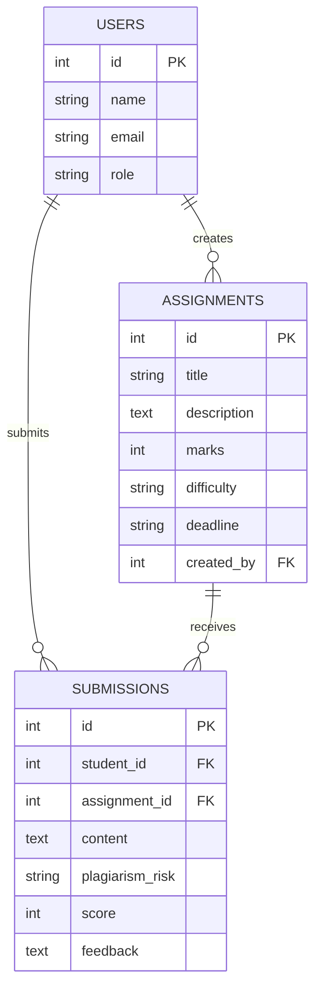

# 🚀 Assignment Evaluation & Feedback Platform

## 📌 Project Overview

The **Assignment Evaluation & Feedback Platform** is a full-stack web application that enables:

- 🎓 Students to submit assignments (Text or PDF)
- 👨‍🏫 Instructors to create and manage assignments
- 🤖 AI-based automatic evaluation
- 📊 Plagiarism detection and scoring

The system integrates AI/ML techniques such as **TF-IDF and Cosine Similarity** to detect plagiarism risk and generate automated feedback.

---

## 🛠 Tech Stack

### 🔹 Frontend
- React (Vite)
- Tailwind CSS
- Axios
- React Router

### 🔹 Backend
- FastAPI (Python)
- SQLAlchemy
- Pydantic
- SQLite

### 🔹 AI / ML
- TF-IDF Vectorizer
- Cosine Similarity
- Rule-based automated feedback

---

## ✨ Features

### 🎓 Student Dashboard
- Enter Name & Roll Number
- Select Assignment
- Submit Text Answer
- Upload PDF Answer
- View:
  - Plagiarism Risk
  - Score
  - AI Feedback

### 👨‍🏫 Instructor Dashboard
- Create Assignments:
  - Title
  - Description
  - Marks
  - Difficulty
  - Deadline
- View All Submissions
- Review AI-generated Feedback
- Delete Assignments
- Remove Feedback

---

## 🤖 AI Evaluation Logic

### 1️⃣ Plagiarism Detection
- Uses **TF-IDF + Cosine Similarity**
- Compares new submission with existing submissions
- Returns similarity percentage

### 2️⃣ Automated Feedback
- Based on word count logic
- Generates:
  - Feedback message
  - Auto score

### Example Output

```json
{
  "submission_id": "S103",
  "plagiarism_risk": "22%",
  "feedback_summary": "Decent attempt, but explanation depth can be improved.",
  "score": 68
}
```

---

## 🗄 Database Design

### 👤 Users Table
- id
- name
- email
- role (student / instructor)

### 📚 Assignments Table
- id
- title
- description
- marks
- difficulty
- deadline
- created_by

### 📄 Submissions Table
- id
- student_id
- assignment_id
- content
- plagiarism_risk
- score
- feedback

---

## 🚀 Installation Guide

### 🔹 Backend Setup

```bash
cd backend
pip install -r requirements.txt
uvicorn app.main:app --reload
```

Backend runs at:

```
http://127.0.0.1:8000
```

Swagger Docs:

```
http://127.0.0.1:8000/docs
```

---

### 🔹 Frontend Setup

```bash
cd frontend
npm install
npm run dev
```

Frontend runs at:

```
http://localhost:5173
```

---

## 🌍 Deployment

### Frontend
Deploy using:
- Vercel

### Backend
Deploy using:
- Render
- Railway
- AWS
- Azure

---

## 📂 Project Structure

```
backend/
  app/
    models.py
    schemas.py
    database.py
    ai_engine.py
    routes/
      assignments.py
      submissions.py

frontend/
  src/
    pages/
    components/
    services/
```

---

## 🎯 Learning Outcomes

- Full Stack Development
- REST API Design
- AI/ML Integration
- Plagiarism Detection Logic
- Database Modeling
- File Upload Handling
- Frontend-Backend Integration

---

## 🏆 Project Status

- ✅ Frontend Complete
- ✅ Backend Complete
- ✅ AI Integration Complete
- ✅ Database Designed
- ✅ REST APIs Implemented
- ✅ File Upload Supported
- ✅ Ready for Deployment

---

## 👨‍💻 Author

jayachandra
# 📊 ER Diagram – Assignment Evaluation & Feedback Platform

## 🗄 Database Entity Relationship Diagram



---

## 🔎 Relationship Explanation

### 👤 User
- Can be **Student** or **Instructor**
- One instructor can create multiple assignments
- One student can submit multiple submissions

### 📚 Assignment
- Created by one instructor
- Can have multiple student submissions

### 📄 Submission
- Belongs to one student
- Linked to one assignment
- Contains AI evaluation results

---

## 🔗 Relationship Summary

| Relationship | Type |
|--------------|------|
| User → Assignment | One-to-Many |
| User → Submission | One-to-Many |
| Assignment → Submission | One-to-Many |

---

## 🎯 Database Flow

1. Instructor creates Assignment  
2. Student selects Assignment  
3. Student submits Answer  
4. AI evaluates submission  
5. Feedback & Score stored in Submission table  

---

